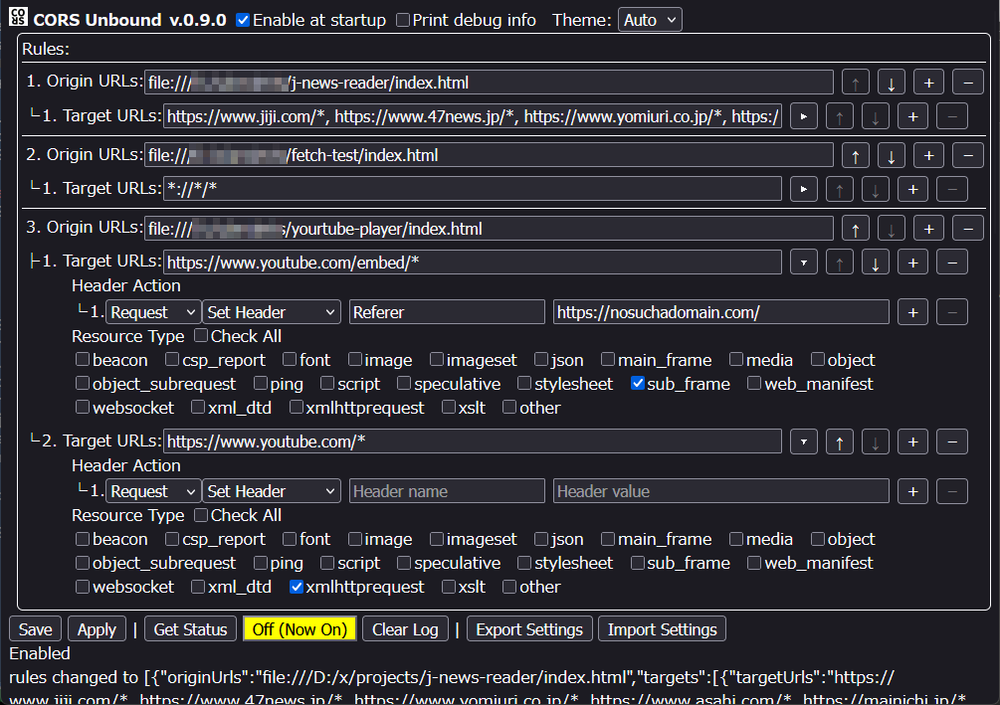

# 📘 **CORS Unbound – Firefox Extension**  
### **Bypass CORS and rewrite HTTP headers directly in the browser**  
_No server. No proxy. Full control._

CORS Unbound is a Firefox extension that bypasses CORS restrictions and rewrites HTTP request/response headers directly inside the browser.  
It is designed for **local development**, **prototyping**, **automation**, **scraping**, and **advanced debugging** — all without running a server.

This extension is the successor to **CORS for Me**, with expanded support for many resource types and a flexible rule‑based system.

---

# 📸 Screenshots



---

# 🚀 Features

### ✔ Automatic CORS Bypass  
Injects the appropriate `Access-Control-*` headers into responses based on the browser’s own CORS request headers.

### ✔ Header Rewriting  
Add, modify, or remove **request** and **response** headers using a rule-based UI.

### ✔ Rule System  
Each rule defines:

- **Origin URLs** (the page making the request)  
- **Target URLs** (the request destination)  
- **Header Actions** (set/remove)  
- **Resource Types** (xmlhttprequest, sub_frame, script, image, websocket, etc.)

### ✔ Browser‑Only Development  
Run your entire web app from `file:///` or local paths without a server.

### ✔ Popup Toggle  
Enable/disable the extension instantly.

### ✔ Options Page  
- Rule editor  
- Debug log  
- Theme selection (Auto / Light / Dark)  
- Export / Import settings  
- Apply without saving

### ✔ Private & Local  
All data is stored using **`browser.storage.local`**.  
No remote servers.  
No analytics.  
No data collection.

---

# 🛠 Installation

This extension is currently in **private beta**.  
AMO publishing will be added later.

### Temporary installation (development)

1. Open `about:debugging#/runtime/this-firefox`
2. Click **“Load Temporary Add-on”**
3. Select `manifest.json`

---

# 🧭 Usage

## 🔹 Popup  
The toolbar popup provides:

- **Enable** — toggle the extension on/off  
- **Settings** — open the Options page  

## 🔹 Options Page Overview

### **General Settings**
- **Enable at startup**  
- **Print debug info**  
- **Theme (Auto / Light / Dark)**  

---

# 📐 Rules Overview

Rules define how CORS and header rewriting behave.

Each rule contains:

---

## 1. Origin URLs

One or more URL patterns for the page making the request.  
Multiple patterns can be separated by commas.

Examples:

```
file:///C:/webapp/index.html
https://example.com/*
file:///C:/webapp/*, https://example.com/app/*
```

---

## 2. Target URLs

Comma‑separated list of URL patterns.

Example:

```
https://api.example.com/*, https://another.com/data/*
```

---

## 3. Header Actions

Each target may contain multiple actions:

- **Message Type**  
  - Request  
  - Response  

- **Action**  
  - Set Header  
  - Remove Header  

- **Header Name / Value**

Example:

```
Name: User-Agent
Value: Firefox
```

---

## 4. Resource Types

Choose which request types the rule applies to:

- xmlhttprequest  
- sub_frame  
- script  
- image  
- websocket  
- stylesheet  
- …and many more

You may also use **Check All**.

---

## 🔎 Rule Matching Behavior

- Rules are evaluated **in order**.
- Each rule may contain **multiple origin URL patterns** and **multiple target URL patterns**.
- A rule matches when **any** origin pattern matches the request’s origin.
- Within that rule, a target matches when **any** target pattern matches the request URL **and** the resource type matches.
- **All matching targets from all matching rules are evaluated.**
- For each matching target, its header actions are collected into two groups:
  - Request headers
  - Response headers
- If multiple actions target the **same header name** (within request or response),
  **only the first action encountered for that header is kept and applied**.

---

# 🔧 URL Pattern Rules

CORS Unbound supports [Firefox’s match pattern syntax](https://developer.mozilla.org/docs/Mozilla/Add-ons/WebExtensions/Match_patterns):

Examples:

```
https://example.com/*
http://*.domain.com/path/*
file:///home/user/project/*
```

Multiple URL patterns can be separated by commas (for both Origin URLs and Target URLs):

```
https://a.com/*, https://b.com/api/*, file:///C:/project/*
```

Invalid patterns are detected and reported in the log.

---

# ⚙ How It Works (Technical Overview)

## Request Phase (`onBeforeSendHeaders`)

- Matches origin URL, target URL, and resource type  
- Applies header actions  
- Captures CORS request headers:
  - `Origin`
  - `Access-Control-Request-Method`
  - `Access-Control-Request-Headers`

These headers may or may not be included in a request, depending on how the browser constructs it.  
The extension simply reads these CORS-related headers when they are present and does not attempt to infer any special request behavior.

---

## Response Phase (`onHeadersReceived`)

Automatically injects missing CORS headers:

- `Access-Control-Allow-Origin`  
- `Access-Control-Allow-Credentials`  
- `Access-Control-Allow-Methods`  
- `Access-Control-Allow-Headers`  
- `Vary: Origin`

This ensures the browser accepts the response even when the server does not provide CORS headers.

---

# 🔒 Protected Headers

Some headers cannot be modified by any extension. Others may be modified but overridden by the browser.

---

# 🔐 Security Notes

- No external servers  
- No analytics  
- All logic runs locally in `background.js`  
- Settings stored using **`browser.storage.local`**

---

# ⚠ Limitations

- Firefox only (uses `webRequestBlocking`)  
- Cannot modify protected headers  
- Some sites may block requests for non‑CORS reasons  
- Requires explicit URL patterns to enable

---

# 📤 Exported Settings Format

Example:

```json
{
  "enableAtStartup": true,
  "printDebugInfo": false,
  "colorScheme": "auto",
  "rules": [...],
  "app": "CORS Unbound v.0.9.0"
}
```

---

# 📜 License

This project is licensed under the **Mozilla Public License 2.0**.

---

# 📝 Documentation Note

This document was generated with the assistance of AI based on the extension’s source code.
